# Dokumentacja projektu

Projekt obejmuje realizację aplikacji webowej CRUD z zastosowaniem wzorca MVC oraz wykonanie do niej testów UI w Selenium.

## Szczegóły projektu

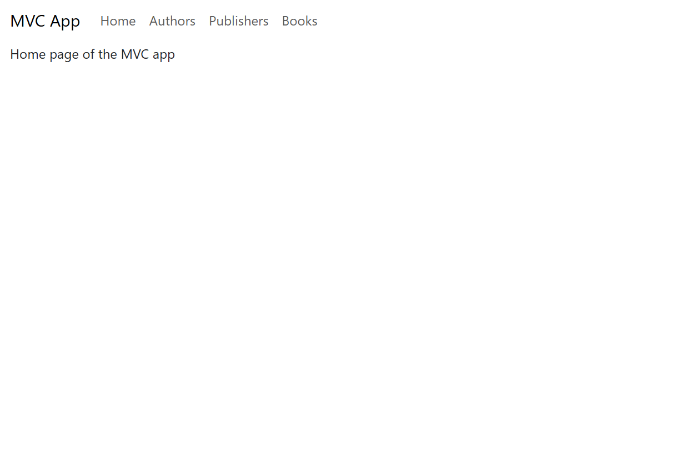

Aplikacja została wykonana w technologii Spring Boot i jest podzielona na 3 moduły i służy do zarządzania książkami. Są to:

- Books - zarządzanie książkami
- Publishers - zarządzanie wydawcami
- Authors - zarządzanie autorami

Każdy moduł udostępnia operacje CRUD za zarządzanego przez siebie typu danych.

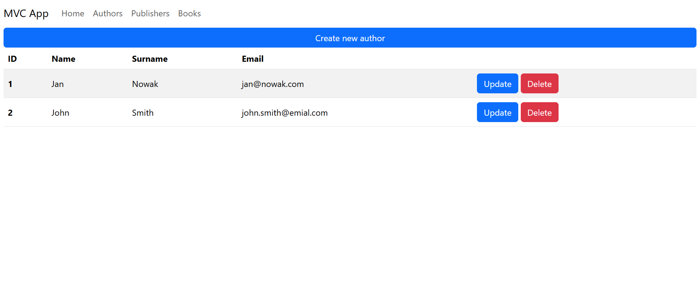
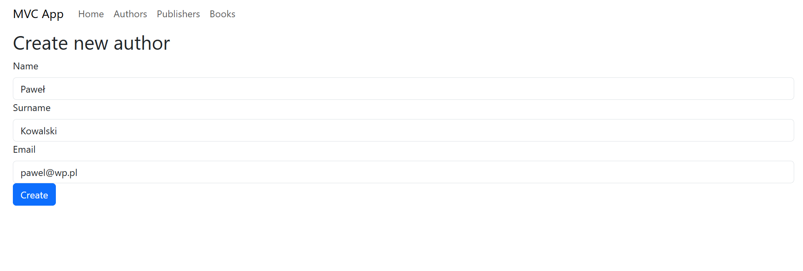
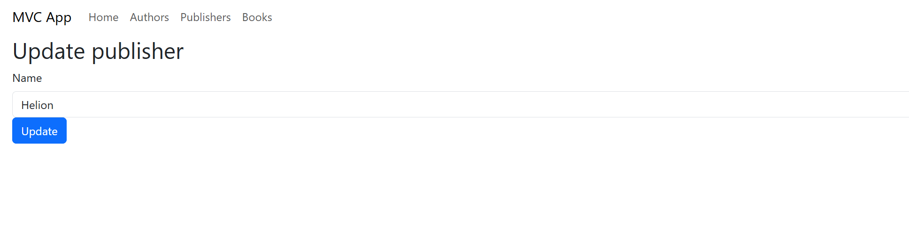

Aplikacja jest połączona z bazą danych za pomocą specjalnej konfiguracji, co umożliwia przechowywanie danych po wyłączeniu projektu.

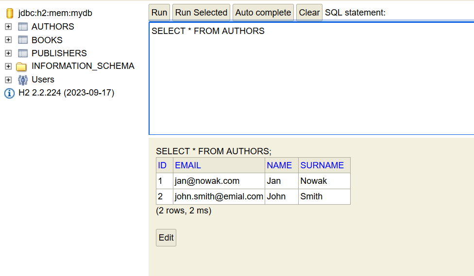

Aplikacja jest podzielona na wiele modułów, które realizują następujące funkcje:

- `/controllers` - kontrolery przetwarzające zapytania HTTP i zwracające strony HTML
- `/models` - encje służące do mapowania obiektowo-relacyjnego
- `/repositories` - dostęp do obiektów w bazie danych
- `/services` - serwisy udostępniające operacje CRUD dla określonych encji

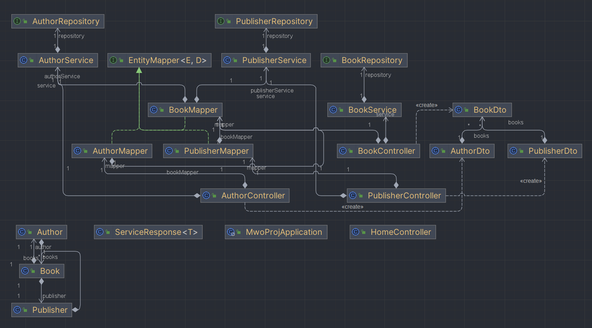

## Testy UI w Selenium

Testy operacji CRUD z poziomu UI wykonałem za pomocą Selenium, JUnit i AssertJ.

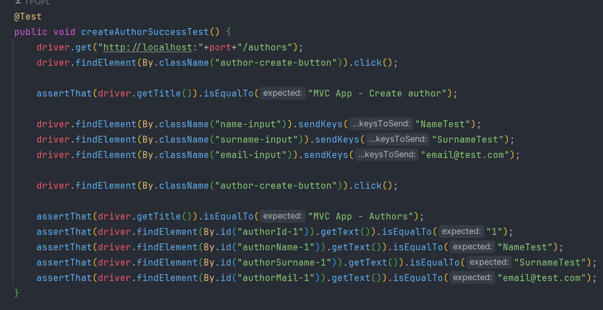

Selenium korzysta z drivera przeglądarki Chrome, który działa w trybie headless, co oznacza że przeglądarka nie jest widoczna.

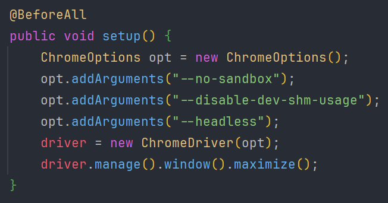

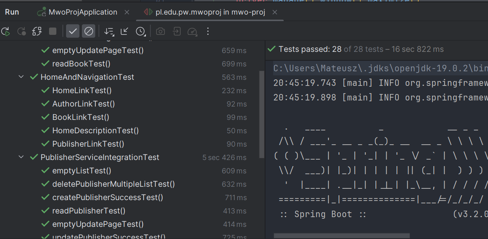

## Konfiguracja GitHub Actions

Utworzyłem pipeline GitHub Actions, który konfiugruje środowisko (Java), buduje aplikację i uruchamia testy UI, a następnie jeżeli wystąpią jakiekolwiek błędy to tworzy Bug na Azure Devops.

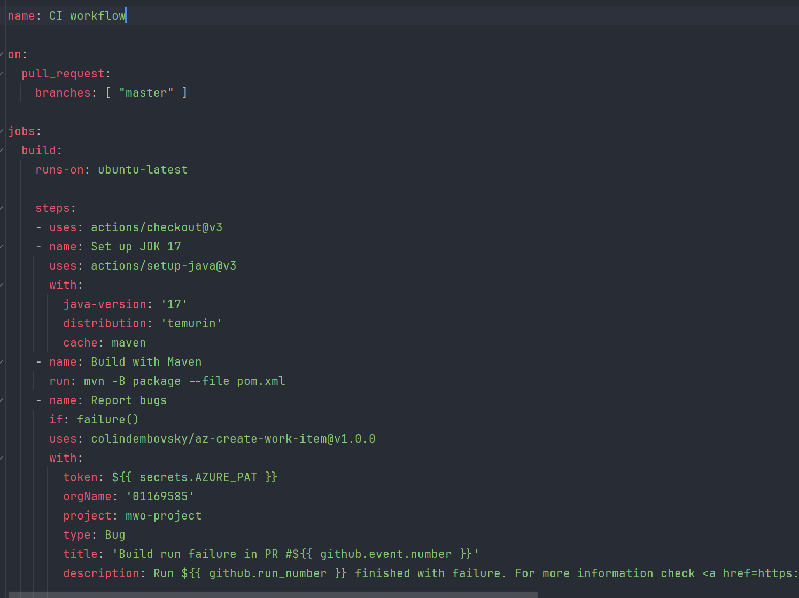

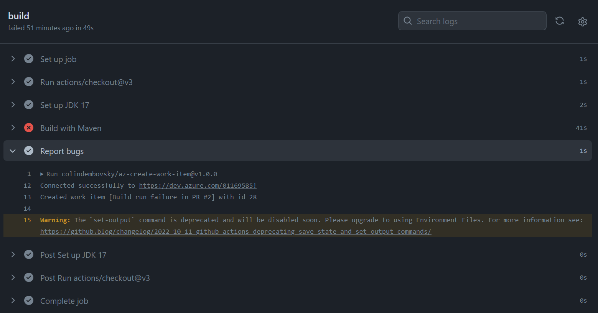

## Integracja z Azure DevOps

Na potrzeby zadania utworzyłem nowy projekt na Azure DevOps.

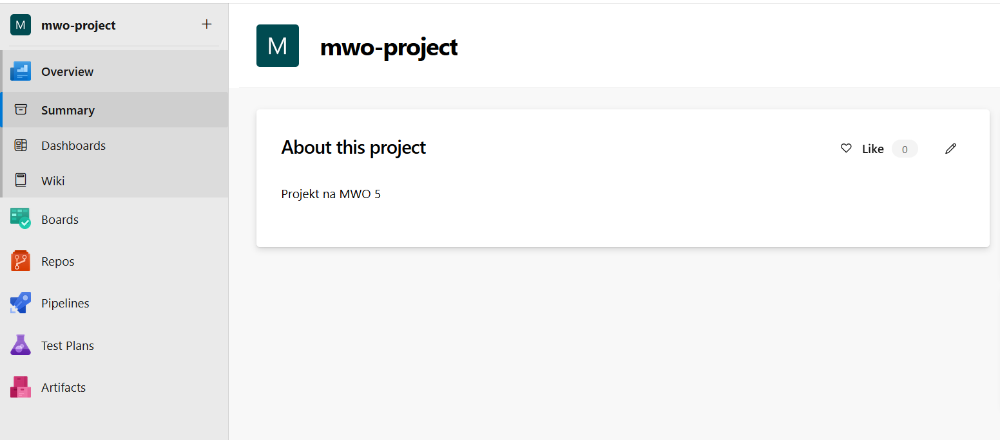

Następnie utworzyłem Personal Access Token służący do łączenia z projektem z poziomu pipeline'a

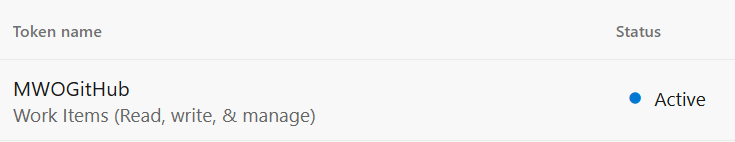

Token umieściłem w sekretach repozytorium.

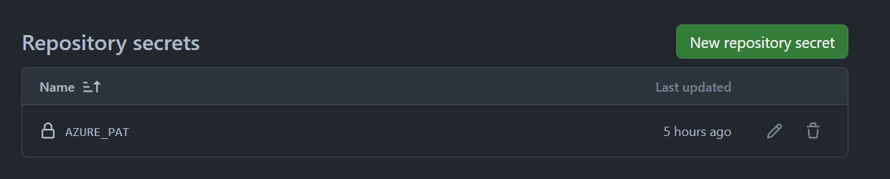

Krok "Report bugs" w jobie odpowiada za tworzenie nowego buga na Azure DevOps jeżeli wystąpił błąd podczas testów.

Przykład działania:

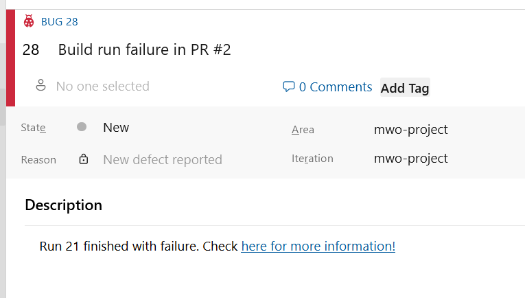

